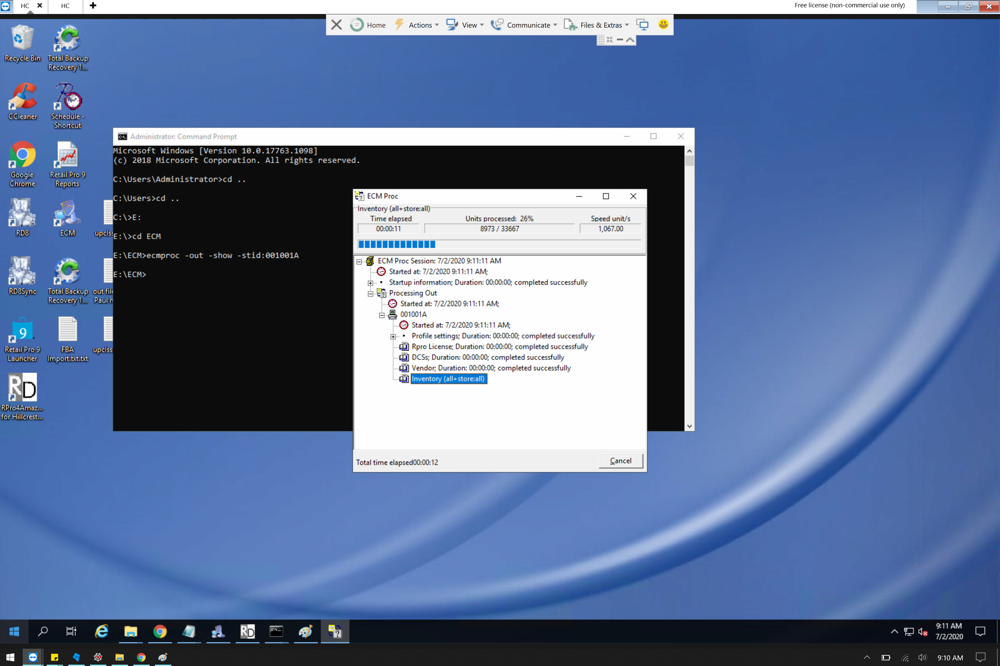
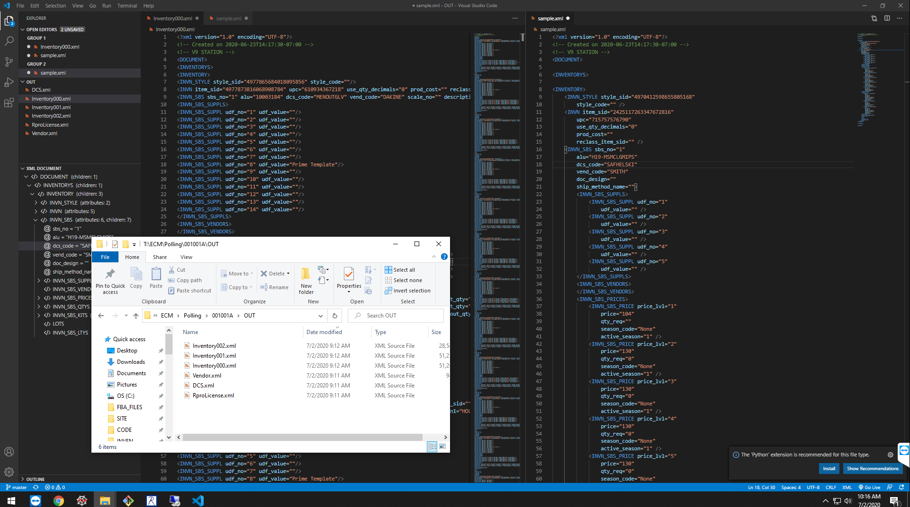
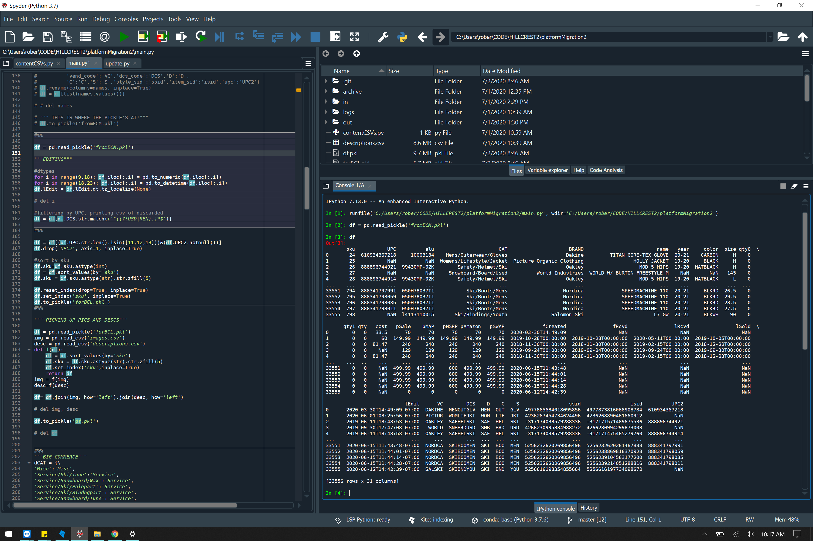
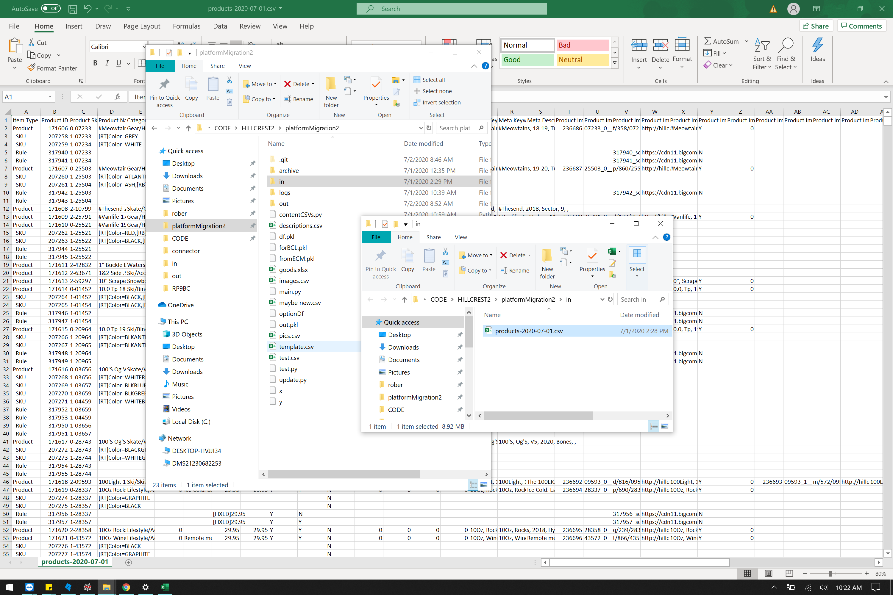
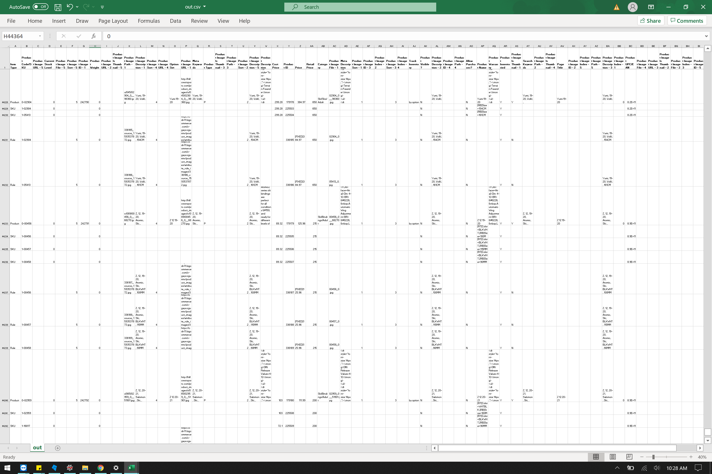
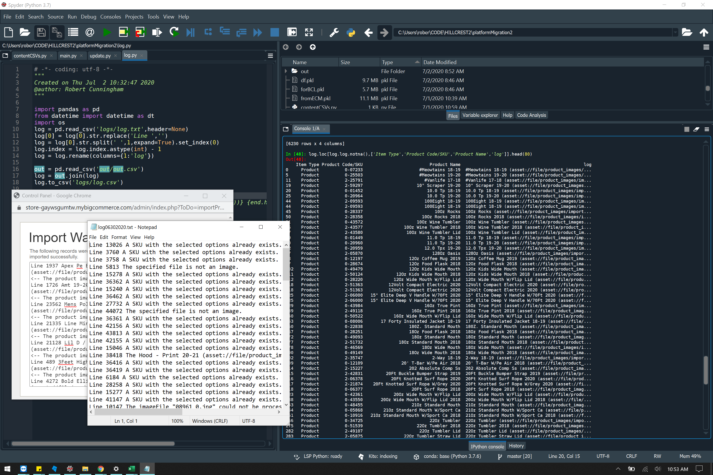
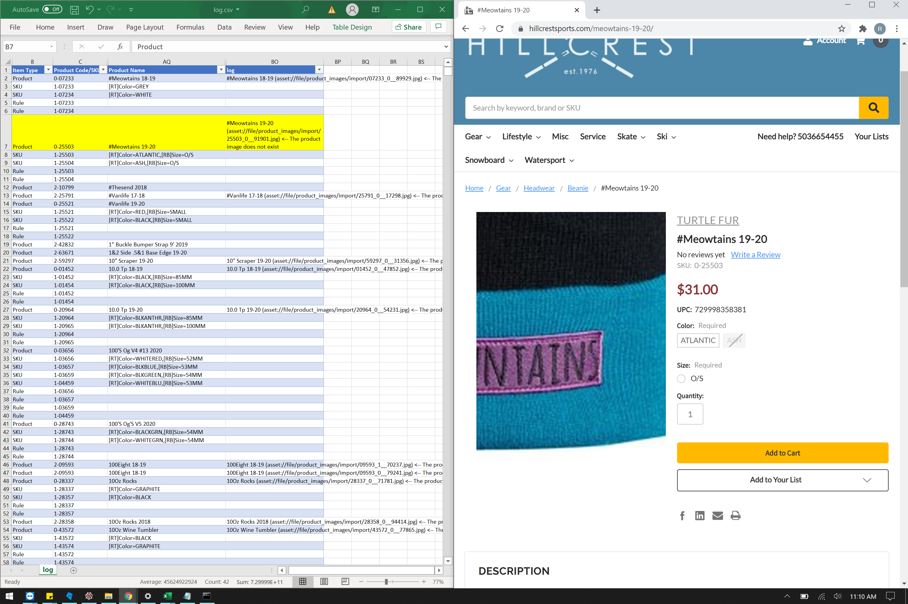

# RPBC - retailPro-bigCommerce
### Authored by Robert Cunningham,
#### support/consulting: rtc@bagpyp.net

The following program extracts inventory data from a working installation of Retail Pro 9  
The data is archived in its various forms for later analysis, but ultimately is converted into
a .csv file that can be consumed by BigCommerce's Product > Import tool accessable in the 
control panel of your store. 

For a brand new store, this program necessitates documents 'images.csv' and 'descriptions.csv' where
images.csv has columns sku, pic0,pic1,...,pic4 and descriptions: sku, description, short_description

## Getting the data out of Retail Pro 9's Oracle database:

Remote Desktop into the server and open a command prompt.
Navigate to the E: drive and then cd to E:\ECM
issue ecmproc -show -out -stid:001001A
The process takes roughly 2 minutes

## Wtf did that just do?

That "Proc Out" just sent xml files containing all the data regarding your inventory that is 
necessary for creating Products and Product Options in your BigCommerce store.  Located at
E:\ECM\Polling\001001A\OUT, these files are ready to be consumed by main.py

## Running main.py

Running the first few cells of the script puts the data into a nice pandas DataFrame, which is
pickled as 'df.pkl' and can be used for all types of reports and analytics about your inventory.
The program can't finish though, because all of the changes that have been made in the Admin Panel
first have to be incorporated with this data, so that if someone added an image or a descriotion
to a product, then those changes will be refelected in the csv that this script produces.

## Pulling store changes before .csv import

## The result

Run main.py and viola (well, after about 2 minutes of number crunching)! in the out/ folder you'll 
find a .csv file named out.csv which can be imported into your bigCommerce store (making sure to 
check the "...using the Bulk Edit template" option).  Import that .csv file and you're done!
If you donwload the BigCommerce app on your phone, you can check in on the Products tab and 
continually refresh the list.  You'll see about 3 new products a second beign posted in your store. 
a copy of out.csv will be archived in archiv/outs/, and your in-file will be in archive/ins/.  
If anything goes wrong, just delete all roducts and reimport the last in-file you pulled from 
bigCommerce

## Logging

Once your import is complete, clisk the "More Information" link in the admin panel and copy the
contents to Notepad.  Name the file 'log.txt' and place it in the logs/ folder.  Run log.py and 
your log file will be converted to csv file that matches errors to the places in out.csv where 
they came from.  log.txt will be placed in the log/archive/ folder

Most of the time you can check a few and see that nothing actually broke.  Like you can seee here,
the image file for #Meowtains uploaded just fine. Suck it bigCommerce!

Now you can go about making changes to products from the admin panel, and whenever there are new products
in Retail Pro that you want on the website, or when you want inventory levels to be synced with the 
website, run this process again.   Your storefront-changes will be left unchanged in the admin panel 
and new products will automatically appear in BigCommerce.  

